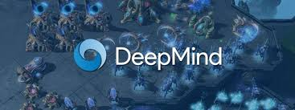

# StarCraftConnection

This project contains a series of StarCraft II reinforcement learning (RL) agents built using PySC2. The **ResourceManagementAgent** is designed to efficiently manage resources by training SCVs, gathering minerals, building supply depots, and constructing barracks. It uses a simulated annealing strategy to balance exploration and exploitation, allowing the agent to test new strategies while gradually converging on optimal decisions. The agent interacts with the game state through PySC2's action and observation spaces, selecting actions based on the current game state and learned policies.

The **MiniGameRLAgent** is a Q-Learning-based agent designed to play StarCraft II mini-games. It maintains a Q-table for state-action values and updates it using the Bellman equation. The agent also applies simulated annealing to adjust the action-selection process dynamically, increasing the likelihood of exploration at higher temperatures and focusing on exploitation as the temperature cools. The project can be extended to multi-agent scenarios, imitation learning, and strategic micro-management by adding more complex state representations and reward functions.